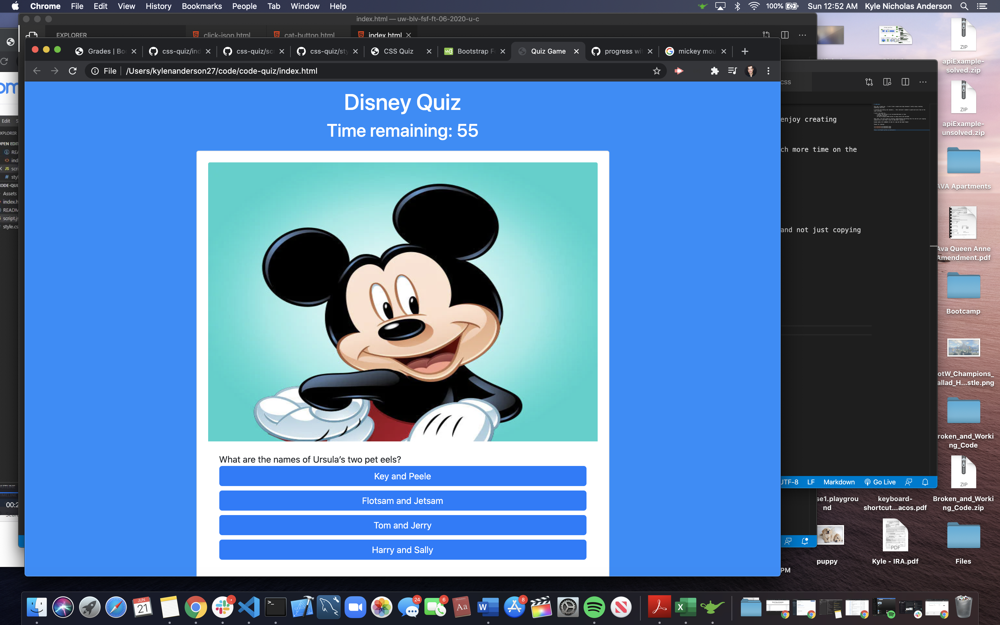

# code-quiz

this was a tough one... I wish I had a couple more days because I really enjoy creating something like this.   

I started with making cool dynamics... then realized I needed to spend much more time on the inner workings.

I wish I was able to:
    - connect the buttons to an increase/decrease in time, 
    - end game function
    - do the stringify/JSON actions to keep scores and username

That said, I am very proud of actually understanding everything thus far and not just copying someone else's work that I have no idea what's going on.

PLEASE LOOK AT MY COMMENTS TO SEE IF I WAS ON THE RIGHT TRACK?

Thanks for looking!

https://wolfdog27.github.io/code-quiz/